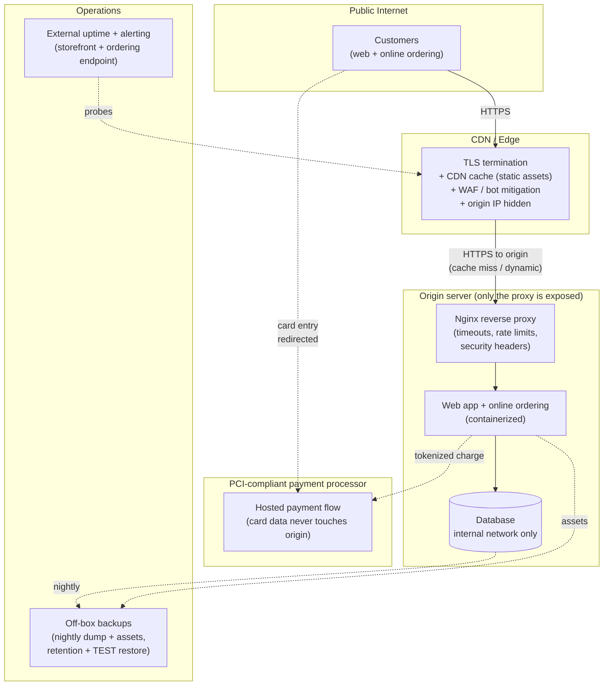

# Running the Web + Backend Infrastructure for a Multi-Location Restaurant Business

For several years I owned the entire web and backend footprint for a family-owned restaurant business doing **$3M+ in annual revenue**: the public website, online ordering, email, DNS, backups, and every piece of glue that kept them online. Real customers, real orders, real money on the line if it went down during a dinner rush.

This is a sanitized, high-level write-up of how that system was built and operated, and of the decisions and trade-offs behind it, which matter more than the parts list.

> **Note on this repo:** This is a generalized, public account of a production system I ran for a private business. There is **no** real business name, customer data, domain, IP, or proprietary configuration anywhere in it. Every hostname, credential, and figure is a placeholder or a round order-of-magnitude (`example.com`, `<REDACTED>`, `db-primary`). The architecture, the reasoning, and the operational lessons are real; the specifics are deliberately scrubbed. Where a metric would normally be a hard number, I've kept it qualitative or bracketed rather than invent precision I can't stand behind in a conversation. The git history is a single squashed commit because this write-up was sanitized from a private working copy before publishing.

---

## Problem

A restaurant group that takes orders online has a website that is not a brochure. It is **revenue infrastructure**. When it's slow, orders don't get placed. When it's down at 6:45pm on a Friday, that's not a support ticket, it's lost dinner service the business never gets back. And unlike a tech company, there is no on-call rotation, no platform team, no runbook. There's me.

The business started where most small businesses start: a website and email bolted onto whatever a previous vendor set up, spread across accounts nobody had full credentials for, on hosting nobody could describe. The concrete problems:

- **No clear ownership of the stack.** DNS was at one registrar, email at another provider, the site on a third party's shared hosting, and the "admin" was a login somebody's nephew set up years ago. Nobody could answer "if this breaks, who fixes it and how?"
- **Uptime mattered but nothing protected it.** The site was a single point of failure with no monitoring, no backups anyone had ever tested, and no way to know it was down until a customer called.
- **It handled real customer and order data.** Contact details, order history, and payment flows, which means it carried real obligations around confidentiality and availability, not just "keep the marketing site up."
- **The budget was a small business's budget.** No room for an enterprise CDN contract or a managed platform team. Every dollar of infrastructure spend competed directly with payroll and food cost.

The job was to turn an inherited, undocumented, fragile setup into something I fully owned, could reason about, could recover, and could keep online through a dinner rush, all **on a small business's budget.**

---

## What I Built

I consolidated a scattered, vendor-tangled setup into a single stack I owned end to end: a hardened web application behind a reverse proxy, fronted by a CDN/edge, with real TLS, monitored uptime, and **tested** backups.

The shape of it:

- **One front door.** A CDN/edge provider (Cloudflare-style) sits in front of everything: it terminates TLS with an auto-renewing certificate, absorbs bot and attack traffic before it reaches the origin, caches static assets so a traffic spike doesn't hit the application server, and hides the origin's real IP. The public internet talks to the edge, never directly to the box.
- **A reverse proxy at the origin.** Behind the edge, an Nginx reverse proxy is the only thing listening. It routes requests to the web application, enforces sane timeouts and body-size limits, and gives me one place to add rate limiting, redirects, and security headers.
- **The web application + ordering.** A containerized CMS/storefront (the public site plus online ordering) runs as an application service, isolated from the proxy and the database on separate internal networks. Payment card data is handled by a PCI-compliant payment processor's hosted flow, so the application **never** stores card numbers. That keeps the sensitive-data blast radius small on purpose.
- **A dedicated database tier.** The datastore runs as its own service on an internal-only network: not reachable from the internet at all, only from the application. Credentials live in environment/secret files, never in the image or in version control.
- **Backups that are actually restores.** Nightly automated database dumps and file-asset snapshots, pushed off-box to separate storage, with **retention** and (the part most setups skip) a **periodic test restore**, so I knew the backup was a real recovery path and not a folder full of untested hope.
- **Monitoring and alerting.** External uptime checks on the storefront and the ordering endpoint, so I found out the site was down from an alert on my phone, not from an angry phone call, and could act before dinner service.
- **DNS and email consolidated under my control.** DNS moved to a single provider I administered, with correct records for the web edge and for deliverable transactional email (SPF/DKIM/DMARC) so order confirmations actually landed in inboxes.

### Architecture



The design principle running through all of it: **the origin is small, closed, and boring.** Only the proxy is exposed, the database is invisible from outside, card data lives with the processor, and every piece has one clear owner: me.

### What's in this repo

```
restaurant-web-infrastructure/
├── README.md                     # this file
├── docker-compose.yml            # sanitized origin stack: proxy + app + db
├── .env.example                  # every secret as a stubbed placeholder
├── nginx/
│   └── site.example.conf         # reverse-proxy vhost: TLS-at-edge origin, limits, headers
├── scripts/
│   └── backup.example.sh         # nightly DB + asset backup with retention + restore-test note
└── docs/
    └── runbook.md                # "it's down during dinner service": recovery + decisions
```

Everything is a sanitized example of the *pattern* I ran, not a dump of the real configuration.

---

## Key Decision & Why

**The decision: consolidate onto one stack I fully owned and could recover, rather than keep paying a managed vendor to run a black box, while deliberately keeping the risky, regulated parts (card data, TLS, edge) with specialist providers.**

That's the trade-off I care most about explaining, because it's the same call a business makes when it decides what to build versus buy.

What drove it:

**1. Ownership beats convenience when the thing is revenue-critical.** The inherited setup was "managed" only in the sense that nobody understood it. When something broke, the answer was to file a ticket with a vendor and wait. During a dinner rush, waiting is the one thing you can't afford. Owning the stack meant that when it broke, I could open a terminal and fix it, and I knew exactly what "it" was. For a system where minutes of downtime equal lost orders, the ability to diagnose and recover *myself* was worth more than the convenience of outsourcing.

**2. But own the right things.** I did **not** try to build everything. TLS certificate lifecycle, edge DDoS/bot absorption, and above all **card data** are exactly the places where rolling your own is all downside. So the edge/CDN handles certs and attack traffic, and a PCI-compliant processor handles cards through a hosted flow so card numbers never touch my origin at all. That single choice took the scariest compliance surface off my plate and shrank the blast radius of any origin compromise to "no card data was ever here."

**3. A backup you haven't restored is a hypothesis, not a backup.** The inherited setup had "backups" nobody had ever restored. I treated the tested restore as the actual deliverable. The backup job is just how you get there. Being able to say "I have recovered this system from backup, on purpose, and timed it" is the difference between a real RTO and a wish.

**4. Small business budget forced good instincts, not bad ones.** No budget for an enterprise platform meant leaning on a generous CDN free/low tier, open-source components, and a single well-run origin instead of a sprawling managed platform. The constraint pushed the design toward *simple and verifiable*: fewer moving parts, each of which I understood. For a one-person operation that's a feature, not a compromise.

**The trade-off I accepted, stated plainly:** a single origin server is a single point of failure. I chose to mitigate that with strong backups, a fast tested recovery path, and edge caching that keeps the static site serving even if the origin hiccups, rather than pay for full origin redundancy the business couldn't justify. For a restaurant doing a few million a year, an hour of worst-case recovery time backed by a *proven* restore was the right risk/cost balance. For a business where an hour of downtime is catastrophic, I'd spend differently. Being able to name that line is the point.

That conditional (*right call at this size, different calculus at another*) is exactly the reasoning I'd bring into a customer's environment.

---

## What I'd Do Differently at Scale

This ran one restaurant group on one person's shoulders. Standing it up for a larger organization, or a chain, the design changes in specific, defensible ways:

**Kill the single point of failure.** The single origin becomes redundant application instances behind a load balancer, and the single database becomes a managed/replicated database with automated failover. The edge caching that currently *masks* an origin hiccup would become a real HA tier underneath it.

**Infrastructure as code, not artisanal servers.** The origin here was hand-built and documented in a runbook. At scale I'd define the whole stack declaratively (Terraform + containers/orchestration) so it's versioned, reviewable, and reproducible, and so recovery is "re-apply the config," not "remember what I did."

**Real secrets management.** Credentials in `.env` files are fine for a single owner-operated box; they're wrong for a team. I'd move to a secrets manager (Vault / SOPS-encrypted / cloud-native secret store), injected at runtime, rotated on a schedule, never on disk in plaintext.

**Observability past a ping check.** External uptime checks catch "it's down." At scale I'd add application performance monitoring, structured logs shipped to a central store, and alerting on the leading indicators (checkout latency, error rate, order-submission failures) so I'm paged *before* customers feel it, not after.

**A real RPO/RTO, contracted.** The tested nightly restore becomes a documented, agreed RPO/RTO with more frequent (point-in-time) database backups, and a recovery runbook someone other than me can execute, because at scale the bus factor can't be one.

**Formalize the compliance story.** Keeping card data with the processor already covers the scariest part, but for a larger operation I'd formalize the PCI scope boundary, add a WAF ruleset tuned to the app, tighten security headers and CSP, and put SSO/MFA in front of every admin surface.

None of these are exotic. The point is that the small-business version and the enterprise version share the same backbone: a small closed origin, sensitive data pushed to specialists, tested recovery, monitoring you trust. The differences are exactly the ones a Solutions Engineer should be able to name, justify, and sequence for a customer deciding how much infrastructure their business actually needs.

---

## Why I built this (in one line)

I ran real production infrastructure where downtime cost a real business real money, on a real budget. So when I talk to a customer about uptime, recovery, build-vs-buy, and keeping sensitive data out of scope, I'm talking from having owned the pager, not from a slide.
